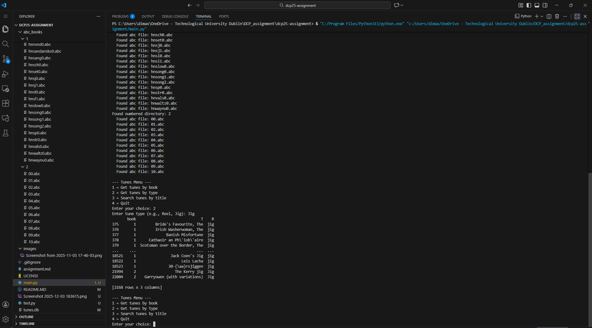
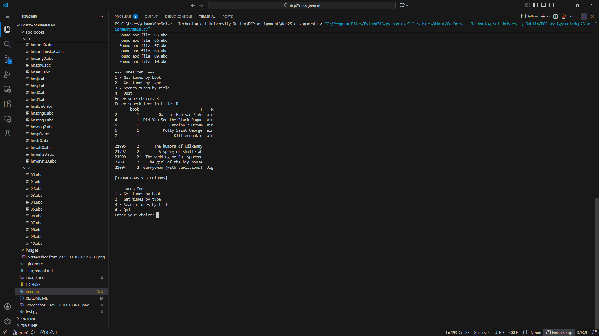
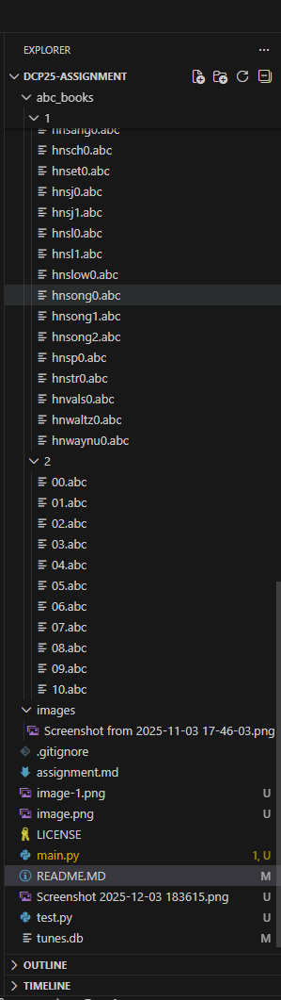

# Data Centric Programming Assignment 2025

- [Assignment Brief](assignment.md)

Name:Oluwadamise Adeniran

Student Number: C24528163

# Screenshots
- 
- 
- 
- 

# Description of the project
This project parses abc tune files, stores them in a databasse an allows for the interaction of the it using an interactive menu for the filtering of data
# Instructions for use
simply enter your number in whihc you want to do there are 4 options whihc are get tunes by book , get tunes by type , search tunes by titles and quit the interactive menu

# How it works:
My code works by first parsing the files from their folders after that it inserts them into the tunes database(tunes.db) after that is coplete it loads up an interacvtive window in which a user of the program can do various things after that you can find tunes by various filters 
With T = Title and R = Type
# List of files in the project

| Files | Source |
|-----------|-----------|
| main.py | Self written |
| test.py | Modified from [main.py]() |

# References
* Bryan Duggan Lecture notes
* Bryan Duggan's Youtube page 
* https://github.com/hx1997/dayu 

# What I am most proud of in the assignment

I am proud I finished this assignment in which I struggled with in the beginning 

# What I learned

I learnt how to create an interactive menu with various functions in it

